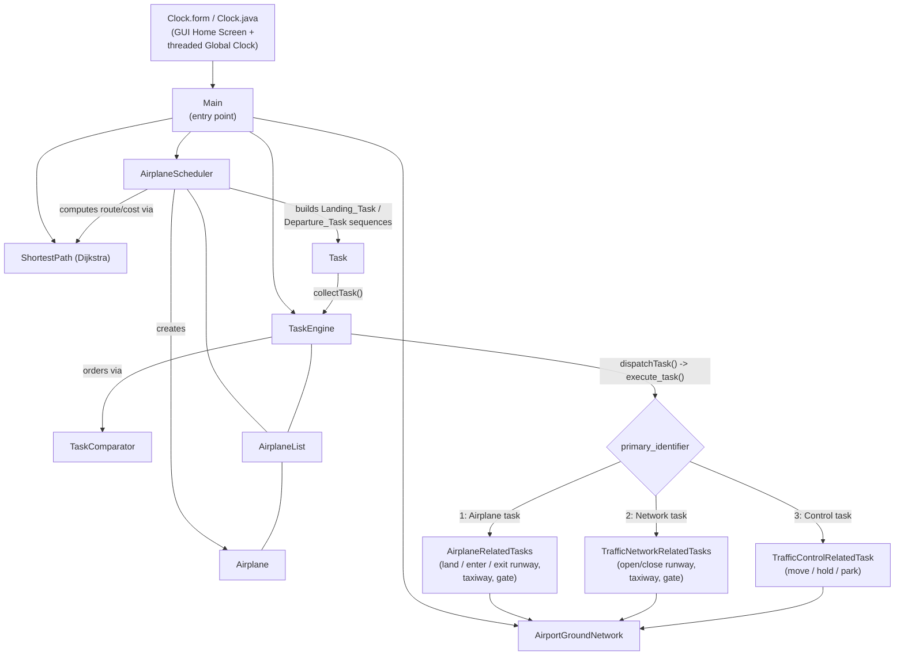
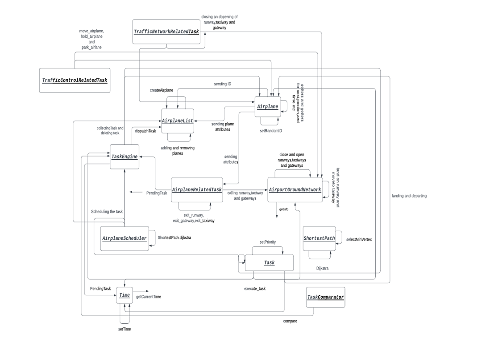
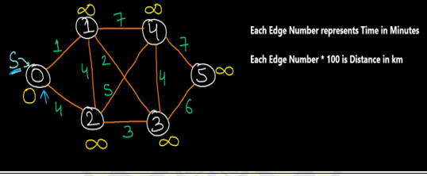
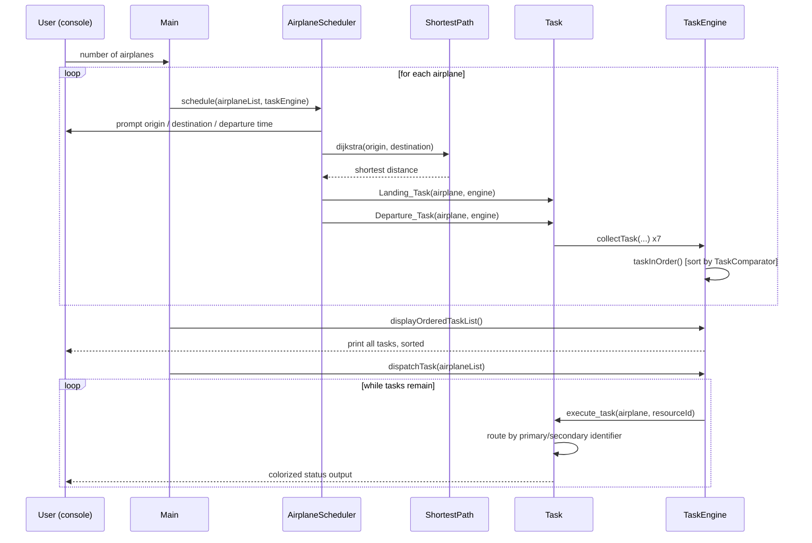
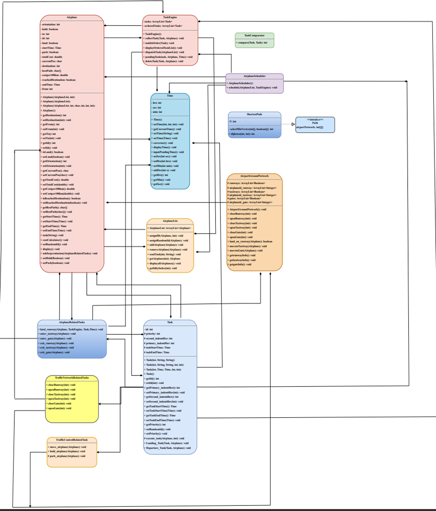
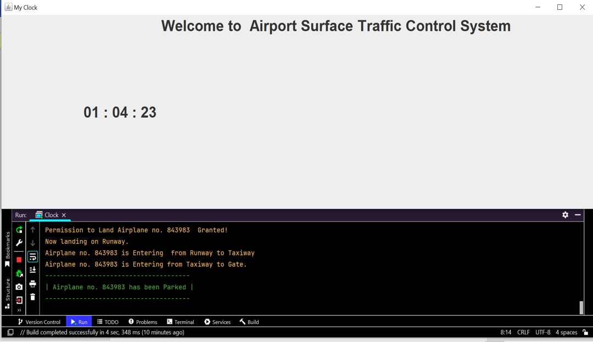
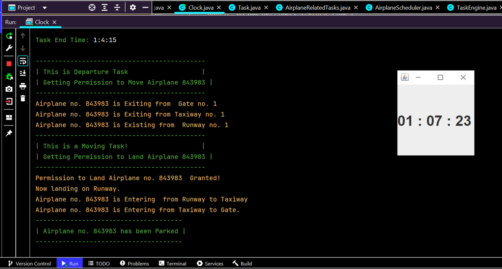

# Simulation of Airport Surface Traffic Control (ASTC) System


## Table of Contents

- [Abstract](#abstract)
- [1. Introduction & Objective](#1-introduction--objective)
- [2. Need for the Project](#2-need-for-the-project)
- [3. Key Components & Features](#3-key-components--features)
- [4. Project Structure](#4-project-structure)
- [5. System Architecture](#5-system-architecture)
- [6. Description and Methodology — Classes Used](#6-description-and-methodology--classes-used)
- [7. Virtual Path (Airport Network Graph)](#7-virtual-path-airport-network-graph)
- [8. Assumptions](#8-assumptions)
- [9. Task System & Priorities](#9-task-system--priorities)
- [10. Execution Flow](#10-execution-flow)
- [11. Getting Started](#11-getting-started)
- [12. Results & Output Explanation](#12-results--output-explanation)
- [13. Delay and Pending Logic](#13-delay-and-pending-logic)
- [14. Mathematical Modeling](#14-mathematical-modeling)
- [15. Limitations](#15-limitations)
- [16. Team Collaboration](#16-team-collaboration)
- [17. Conclusion](#17-conclusion)

---

## Abstract

This project, **"Object Oriented Modeling and Simulation of Airport Surface Traffic Control (ASTC) System,"** implements a computer-based simulation of airport surface traffic control operations in Java. Airport Surface Traffic Control governs the safe and efficient movement of aircraft on the ground — landing, taxiing, gate assignment, and departure — and this project models that domain using object-oriented design principles: encapsulation, inheritance, and polymorphism.

The system is architected as a **task-driven simulation**: rather than entities calling one another directly, every action (an aircraft requesting to land, a controller opening a runway, a plane being told to hold) is represented as a discrete `Task` object with an identifier, a priority, and a time mark. A central `TaskEngine` collects, orders, and dispatches these tasks, closely following the classical ASTC simulation design pattern (task collection → priority queuing → branching → dispatch → pending/delete). A GUI **Home Screen** hosts a **threaded Global Clock**, while the interactive scheduling and simulation narration run on the terminal in ANSI-colored output for readability.

---

## 1. Introduction & Objective

The primary goal of this project is to **model and simulate the operations of an Airport Surface Traffic Control system** — the coordination and management of activities on the airport surface such as taxiing, runway operations, gate assignments, and ground movement of aircraft.

While object-oriented techniques have long been adopted in mainstream software engineering, they remain comparatively under-used in airport and airspace simulation, where procedural paradigms still dominate and make models difficult to enhance, debug, and maintain. This project applies OOP concepts — objects such as `Airplane`, `AirportGroundNetwork`, `Task`, and `TaskEngine` — to build a more maintainable, extensible surface-traffic simulation.

---

## 2. Need for the Project

- **Safety** — Airport surface traffic control is critical to the safety of aircraft and passengers. Simulating these operations allows potential safety risks (e.g. runway conflicts, resource contention) to be identified and studied before they occur in the real world.
- **Efficiency** — Efficient ground operations reduce taxi times, minimize delays, and optimize airport capacity. Simulation allows evaluation and improvement of surface traffic control procedures.
- **Training** — The simulation can serve as a training aid for air traffic controllers, ground staff, and other airport personnel, offering a realistic environment to practice coordination and decision-making.

**Benefits delivered by this project:**

| Benefit | Description |
|---|---|
| Risk Assessment | Identify and address potential safety risks in ground operations. |
| Operational Efficiency | Optimize taxi routes, gate assignments, and related procedures. |
| Training & Skill Development | Realistic environment for personnel involved in surface traffic control. |
| Decision Support | Evaluate different operational scenarios and their impact on airport performance. |

---

## 3. Key Components & Features

- **Aircraft Movements** — Simulates aircraft taxiing on the ground, including interaction with runways, taxiways, and gates.
- **Runway Operations** — Simulates takeoff and landing sequences, including sequencing and clearance management.
- **Gate Assignments** — Manages allocation of gates to arriving and departing flights based on availability and operational constraints.
- **Communication / Coordination** — Models the message-passing protocol between air traffic control, ground control, and airport service objects via the task system.
- **Task-Driven Simulation Engine** — A central `TaskEngine` collects, orders (by time and priority), dispatches, delays (pending), and deletes tasks throughout the simulation lifecycle.
- **Shortest Path Computation** — Dijkstra's algorithm computes the optimal ground route and travel cost between airport nodes.
- **GUI Home Screen & Global Clock** — A graphical home screen hosts the simulation's **Global Clock**, implemented with threading so the clock advances independently while the terminal handles interactive input/output.
- **Colorized Console Narration** — All scheduling and dispatch activity (permission grants/denials, resource allocation, state changes) is printed to the terminal using ANSI color codes for readability.

---

## 4. Project Structure

```
Object-Oriented-Airport-Traffic-Simulation/
├── Main.java                        # Entry point — drives the simulation loop
├── Airplane.java                    # Aircraft entity: state, position, cost, path
├── AirplaneList.java                # Collection/registry of all Airplane objects
├── AirplaneScheduler.java           # Interactive flow for scheduling a new flight
├── AirplaneRelatedTasks.java        # Handlers for aircraft <-> ground-network actions
├── AirportGroundNetwork.java        # Runway / taxiway / gate resource pools
├── Path.java                        # Interface defining the static network adjacency matrix
├── ShortestPath.java                # Dijkstra's algorithm over the airport graph
├── Task.java                        # Base task class: identifiers, priority, timing, dispatch
├── TaskComparator.java              # Orders tasks by start time, then priority
├── TaskEngine.java                  # Central task queue: collect / order / dispatch / delete
├── TrafficControlRelatedTask.java   # Handlers for move / hold / park commands
├── TrafficNetworkRelatedTasks.java  # Handlers for opening/closing runways, taxiways, gates
├── Time.java                        # hrs:min:sec time value object with correction logic
├── Clock.java / Clock.form          # GUI Home Screen + threaded Global Clock
├── Project Statement.pdf            # Original academic project brief (ASTC system design)
├── project report.docx              # Official submitted project report
└── README.md
```

All simulation classes live in the `Project` package (`package Project;`) and rely on the Java standard library (`java.util`, `java.text`) — no third-party runtime dependencies are required for the core simulation logic.

---

## 5. System Architecture



The design follows the classical ASTC simulation pattern: entities communicate exclusively through `Task` objects rather than direct calls, the `TaskEngine` acts as the priority-ordered message queue, and `Task.execute_task()` performs the two-level branching (primary identifier → subsystem, secondary identifier → specific action) that routes each task to its handler.

---

## 6. Description and Methodology — Classes Used

### `TaskEngine.java`
The **central component** of the simulation. It manages tasks assigned to airplanes, ensuring proper sequencing and execution. Key responsibilities:
- Collecting tasks for airplanes (`collectTask`).
- Sorting them by start time and priority (`taskInOrder`, backed by `TaskComparator`).
- Dispatching tasks to the relevant modules (`dispatchTask`).
- Handling delayed/pending tasks and re-queuing them (`pendingTask`).
- Deleting completed tasks (`deleteTask`).
- Displaying the ordered task list for reporting/monitoring (`displayOrderedTaskList`).

### `Task.java`
Represents a specific task assigned to an airplane. Includes attributes such as ID, priority, primary/secondary identifiers, and start/end times. Generates random IDs, sets task priority based on its identifiers (`setPriority`), and executes tasks related to airplane movement, runway operations, and traffic control (`execute_task`). It also builds the scheduling chains for landing (`Landing_Task`) and departure (`Departure_Task`). `Task` has three derived classes:

- **`AirplaneRelatedTasks.java`** — functions related to airplane tasks (land on runway, enter/exit taxiway, enter/exit gate).
- **`TrafficControlRelatedTask.java`** — functions related to traffic control, i.e. moving, holding, and parking airplanes.
- **`TrafficNetworkRelatedTasks.java`** — functions related to the traffic network, i.e. opening/closing runways, taxiways, and gateways.

### `TaskComparator.java`
A comparator for sorting `Task` objects. Compares tasks based on their start times and, in case of equal start times, prioritizes tasks based on their priority values.

### `Airplane.java`
Represents airplanes in the simulation, storing information such as ID, orientation, current position, destination, and travel-related details. Includes methods for setting random IDs, calculating travel costs (`costCalculator`), and displaying airplane information (`display`). Also carries attributes to manage holding and parking status during the simulation.

### `AirplaneList.java`
Manages the list of airplanes in the simulation. Provides functionality to create airplanes, assign IDs (random or specified), add/remove airplanes from the list, send tasks to specific airplanes, retrieve airplanes by ID, and display information about all airplanes. Acts as the central repository for handling airplane-related operations.

### `AirplaneScheduler.java`
Responsible for scheduling tasks for airplanes. It interacts with `AirplaneList.java` and `TaskEngine.java` to create a new airplane, set its departure and destination locations, gather departure-time input, calculate arrival time based on the shortest path, calculate cost, and then collect and prioritize the task for that airplane. This class facilitates the initiation of tasks for airplanes within the system.

### `AirportGroundNetwork.java`
Models the ground network infrastructure of the airport — runways, taxiways, and gates — using `ArrayList`s to track the availability of each. Provides methods to retrieve the current occupancy status of every resource, indicating whether it is occupied and, if so, by which airplane. Essential for managing ground movements and allocations for airplanes.

| Resource | Count |
|---|---|
| Runways | 4 |
| Taxiways | 12 |
| Gates | 24 |

### `ShortestPath.java`
Implements **Dijkstra's algorithm** to find the shortest path from a given starting node to all other nodes in a weighted graph. Calculates shortest-path distances and constructs the shortest-path structure. Exposes `dijkstra(startNode, endNode)`, returning the shortest distance between two nodes — used to determine the optimal ground path for airplanes. Implements the `Path` interface.

### `Path.java`
An interface containing a 2D array that forms the graph acting as the airport's virtual path/network.

### `Clock.java` / `Clock.form`
Implement the **Home Page** of the application and run the **Global Clock**, using threading so the clock advances in real time independently of the terminal-driven scheduling/dispatch flow.

---




## 7. Virtual Path (Airport Network Graph)

The airport surface is represented as a fixed **6-node weighted graph**, with node `0` acting as the primary runway/entry node in the task-handling logic:




Adjacency matrix (`Path.airportNetwork`, `0` = no direct edge):

|    | 0 | 1 | 2 | 3 | 4 | 5 |
|----|---|---|---|---|---|---|
| **0** | – | 1 | 4 | – | – | – |
| **1** | 1 | – | 4 | 2 | 7 | – |
| **2** | 4 | 4 | – | 3 | 5 | – |
| **3** | – | 2 | 3 | – | 4 | 6 |
| **4** | – | 7 | 5 | 4 | – | 7 |
| **5** | – | – | – | 6 | 7 | – |

`ShortestPath.dijkstra(from, to)` returns the minimum-cost route between any two nodes on this graph, used both to estimate arrival time and to compute `Airplane.totalCost`.

---

## 8. Assumptions

- Number of **Runways** is assumed to be **4**, numbered from **0**.
- Number of **Taxiways** is assumed to be **12**, numbered from **0**.
- Number of **Gates** is assumed to be **24**, numbered from **0**.
- **Cost per 100 km distance = 100 units.**
- **Task priorities** are assigned automatically in code through **primary and secondary identifiers** (see [Section 9](#9-task-system--priorities)).

---

## 9. Task System & Priorities

Every `Task` is classified by a **primary identifier** (the subsystem that owns it) and a **secondary identifier** (the specific action within that subsystem), and receives a numeric priority via `Task.setPriority()`:

| Primary | Subsystem | Secondary | Action | Priority |
|---|---|---|---|---|
| 1 | Airplane-related (`AirplaneRelatedTasks`) | 1 | Land on runway | 3 |
| 1 | | 2 | Exit runway | 9 |
| 1 | | 3 | Exit taxiway | 8 |
| 1 | | 4 | Exit gate (depart) | 7 |
| 1 | | 5 | Enter taxiway | 4 |
| 1 | | 6 | Enter gate | 5 |
| 2 | Traffic-network-related (`TrafficNetworkRelatedTasks`) | 1 | Close runway | 15 |
| 2 | | 2 | Close taxiway | 14 |
| 2 | | 3 | Close gate | 13 |
| 2 | | 4 | Open runway | 10 |
| 2 | | 5 | Open taxiway | 11 |
| 2 | | 6 | Open gate | 12 |
| 3 | Traffic-control-related (`TrafficControlRelatedTask`) | 1 | Move airplane | 2 |
| 3 | | 2 | Hold airplane | 1 |
| 3 | | 3 | Park airplane | 0 |
| 0 | Scheduling Task | — | — | 10 |

**Landing sequence** (`Task.Landing_Task`), each step offset +10s from the previous: land runway (1,1) → enter taxiway (1,5) → enter gate (1,6) → park (3,3).

**Departure sequence** (`Task.Departure_Task`), each step offset +10s from the previous: exit gate (1,4) → exit taxiway (1,3) → exit runway (1,2).

---

## 10. Execution Flow





This flowchart explains the basic flow of the program: the user is asked how many planes to schedule, the `AirplaneScheduler` prompts for current location, destination, and departure time; the landing time is set automatically via Dijkstra's algorithm; the departure task automatically generates the full series of tasks (exit gate, exit taxiway, exit runway, move, request landing permission, land on runway, move to taxiway, move to gate, etc.), each offset in time from the last, and sends them to the `collectTask` function in the `TaskEngine`. All tasks are sorted. If a task is delayed (e.g. all runways occupied), it is pushed back via the pending-task logic; on completion, tasks are removed from the list.

---

## 11. Getting Started

### Prerequisites
- **JDK 8 or later**.
- A terminal that supports **ANSI escape codes** for colored output (most Linux/macOS terminals, and Windows Terminal / recent PowerShell / VS Code's integrated terminal on Windows).
- IntelliJ IDEA or Eclipse (as used by the original development team) for the easiest project/package setup, or any standard `javac`/`java` toolchain.

### Compiling

All source files declare `package Project;`, so compile from the **parent directory** of this repo folder, or adjust accordingly. From this project folder:

```bash
# From the repository root
mkdir -p out/Project
javac -d out *.java
```

This compiles all classes into `out/Project/*.class` (matching the `Project` package declaration).

### Running

```bash
java -cp out Project.Main
```

Launch opens the **GUI home screen with the running Global Clock**; the interactive scheduling flow and simulation narration continue in the terminal. You will be prompted for:
1. **Number of airplanes** to schedule.
2. Per airplane: **current location** (0–5), **destination** (0–5, different from current location), and a **departure time** (hours, minutes, seconds).

After all airplanes are scheduled, the program prints the full ordered task list, then dispatches (executes) every task in order, printing each step of every aircraft's landing/departure sequence.

> On Windows via PowerShell/cmd, replace `mkdir -p` with `New-Item -ItemType Directory -Force out`. Opening the project in IntelliJ IDEA or Eclipse with the `Project` package layout recognized is the simplest way to build and run it, consistent with how it was originally developed.

---

## 12. Results & Output Explanation

**Main Output:** The Home Screen and Global Clock run on the GUI, while input and output for the scheduling/dispatch simulation are shown on the terminal in colored style.

**Explanation of the flow:**

1. The user is asked how many planes they want to schedule.
2. The `AirplaneScheduler` prompts the user for the current location and destination of the plane, and for the departure time.
3. The landing/arrival time is computed automatically via Dijkstra's algorithm.
4. The departure task automatically generates a full series of tasks — exit gate, exit taxiway, exit runway, move, request landing permission, land on runway, move to taxiway, move to gate, etc. — each offset in time from the previous one, and dispatches them to the `collectTask` function of the `TaskEngine`.
5. All tasks are kept sorted by time and priority.
6. If a resource is unavailable (e.g. all runways occupied), the affected task is delayed through the **pending task** logic.
7. On completion, tasks are removed from the task list.

**Sample Interaction:**

```
--------------------------------------------------
| Enter the number of Airplanes to be scheduled: |
--------------------------------------------------
1
*Shortest Distance from Node0 to Node5 is: 11

Airplane is Assigned ID: 483920

Enter Current Location(0-5):
0
Enter Destination(0-5):
5
Enter Departure Time in Hours:
14
Enter Departure Time in Mins:
30
Enter Departure Time in Seconds:
0
*Shortest Distance from Node0 to Node5 is: 11

Task ID: 0
Primary Identifier: 1
Secondary Identifier: 1
Priority: 7
Task Start Time: 0:0:0
Task End Time: 0:0:0
...

Permission to Land Airplane no. 483920  Granted!
Now landing on Runway no. 1 !
```



*(Exact IDs, timing, and ordering will vary — airplane IDs are randomized.)*

---

## 13. Delay and Pending Logic

If a task cannot be performed at a given stage — for example, all runways are occupied — that task is delayed via the `pendingTask` function of the `TaskEngine`, which removes the task from the active queue, prompts for a new time, and re-queues it so the aircraft can retry for permission once resources free up.

---



## 14. Mathematical Modeling

Mathematical modeling in this project is centered on the **Shortest Path Algorithm**, where **Dijkstra's Algorithm** is used to calculate the shortest-path travel time, distance, and lowest cost between two nodes of the airport network. Beyond this, straightforward logic governs the state and allocation of runways, taxiways, and gateways, as well as the overall flow of the simulation program.

---

## 15. Limitations

- The program's GUI and terminal responsibilities are split: the Home Screen and Global Clock run on the GUI, while the rest of the simulation (scheduling input and dispatch narration) runs on the terminal.
- The program does not simulate a full ground path for each aircraft; rather, it computes the shortest path/time between two nodes using the location graph and Dijkstra's algorithm, and uses that as the basis for scheduling.
- An `AirfieldTrafficFlowAnimator` (a full graphical animation of aircraft moving through the network) is not implemented.
- The program ran correctly on the team's test runs; however, as a project built during the team's learning years, a few corner cases may remain undiscovered.

---

## 16. Team Collaboration

All three team members — Muhammad Mussa Kazim, Muhammad Taha, and Sohaib Afzal — worked together on this project. A private GitHub repository was maintained to keep the team synchronized with all changes being made simultaneously.

---

## 17. Conclusion

The Airport Surface Traffic Control (ASTC) System project demonstrates a comprehensive simulation and management system for efficiently handling airplane traffic within an airport environment. The object-oriented modeling and simulation approach used in the project provides a realistic representation of various components, including airplanes, tasks, and the ground network. The incorporation of task scheduling, dynamic pathfinding algorithms, and a well-structured object-oriented design enables effective control and coordination of airport surface traffic. The collaborative functioning of all classes ensures a seamless simulation experience, capturing the complexities of real-world airport operations. This project not only provides a valuable tool for studying and optimizing airport traffic control, but also serves as a robust foundation for potential future expansions and enhancements in the field of aviation systems.

---

- *Project Statement.pdf* — "Object Oriented Modeling and Simulation of Airport Surface Traffic Control (ASTC) System," original academic project brief.
- *project report.docx* — Official project report submitted by the team on 16th January, 2023.

## License

No license file is currently included in this repository. All rights reserved by the original authors unless a license is added.
