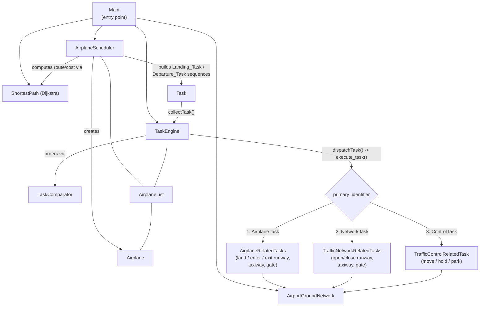
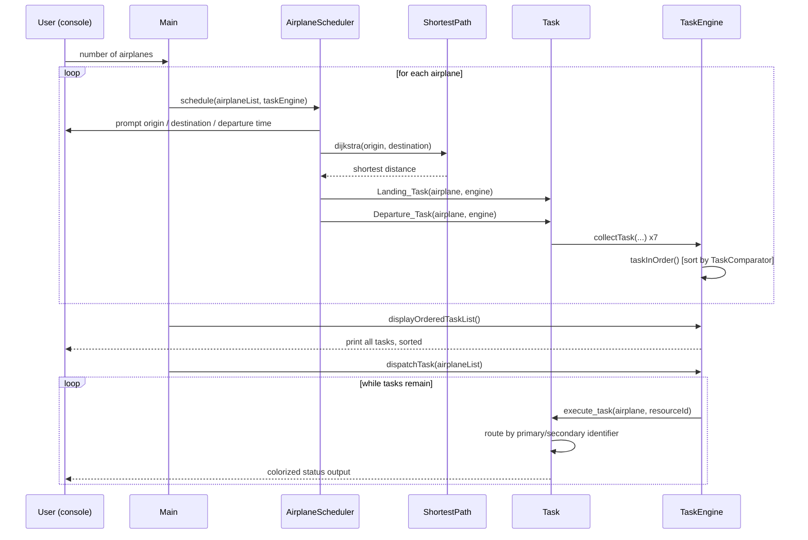

# ✈️ Object-Oriented Airport Traffic Simulation

A **task-driven, console-based Java simulation** of an Airport Surface Traffic Control (ASTC) system. The project models aircraft, runways, taxiways, gates, and an air traffic control tower as interacting objects that exchange messages ("tasks") through a central, priority-ordered **Task Engine**, following classical object-oriented simulation design.


---

## Table of Contents

- [Overview](#overview)
- [Academic Background](#academic-background)
- [Key Concepts](#key-concepts)
- [Project Structure](#project-structure)
- [Architecture](#architecture)
- [Class Reference](#class-reference)
- [The Airport Ground Network Model](#the-airport-ground-network-model)
- [Task System](#task-system)
- [Execution Flow](#execution-flow)
- [Getting Started](#getting-started)
- [Sample Interaction](#sample-interaction)
- [Known Issues & Limitations](#known-issues--limitations)
- [Possible Extensions](#possible-extensions)
- [License](#license)

---

## Overview

The simulation models an airport's surface traffic as a **task-driven system**: instead of directly calling methods on other objects, entities (airplanes, runways, taxiways, gates, the control tower) communicate by creating and dispatching `Task` objects. A central `TaskEngine` collects these tasks, orders them by priority and time, and dispatches them to the correct handler — mirroring real air-traffic-control message flow (e.g. *"airplane requests landing permission" → "controller checks runway availability" → "permission granted/denied"*).

At a high level, the program:

1. Asks the user how many airplanes to schedule.
2. For each airplane, prompts for its origin, destination, and departure time.
3. Computes the shortest travel path/cost between origin and destination using **Dijkstra's algorithm** over a fixed 6-node airport network graph.
4. Generates a full sequence of **landing** and **departure** tasks (land → taxi → gate → park, and gate → taxi → runway → depart) with staggered timestamps and calculated priorities.
5. Displays every task in time/priority order.
6. Dispatches (executes) the tasks, printing colorized console output that narrates runway/taxiway/gate allocation, permission grants/denials, and airplane state changes.

> **Note:** The original repository description mentions a "Java Swing GUI." The current source in this repository is a **console/terminal application** (`Scanner`-based input, `System.out` narration with ANSI color codes) — there is no Swing/AWT GUI code present in the codebase today.

---

## Academic Background

This project is based on the paper/spec **"Object Oriented Modeling and Simulation of Airport Surface Traffic Control (ASTC) System"** (included in the repo as [`Project Statement.pdf`](./Project%20Statement.pdf)). Its core ideas, which shape this implementation:

- **Task-Driven Simulation Engine** — the simulation is organized around a queue of tasks rather than direct procedural control flow. The task engine is responsible for:
  - **Collecting tasks** — adding newly created tasks to the queue.
  - **Dispatching tasks** — releasing a task for execution when the simulation clock matches its time mark.
  - **Branching tasks** — routing a task to the correct sub-handler based on its identifiers.
  - **Pending tasks** — pushing back a task that cannot execute yet.
  - **Deleting tasks** — removing completed/cancelled tasks.
- **Priority Queuing** — tasks are ordered first by start time, then by a priority value, since some tasks (e.g. scheduling a flight) are created early but executed late, while others (e.g. holding an airplane) must run immediately after creation. Landing traffic is generally prioritized over departing traffic.
- **Two-Level Task Identification** — every task carries a **primary identifier** (which subsystem handles it: airplane-related, traffic-network-related, or traffic-control-related) and a **secondary identifier** (the specific action within that subsystem, e.g. *land*, *exit taxiway*, *open gate*, *hold*, *park*).

This repository's classes map directly onto the design described in the paper (`Task`, `TaskEngine`, `AirplaneList`, `Airplane`, `AirportGroundNetwork`, `ShortestPath`) with class/field names adapted to the team's implementation choices.

---

## Key Concepts

| Concept | Description |
|---|---|
| **Task-driven architecture** | All inter-object communication is modeled as discrete `Task` objects rather than direct method calls between "live" simulation entities. |
| **Primary / Secondary identifiers** | Every task is tagged with a 2-level classification used to route it to the right handler (see [Task System](#task-system)). |
| **Priority queue** | Tasks are kept sorted by start time (and, as a tiebreaker, priority) via a custom `Comparator`. |
| **Graph-based airport network** | The airport surface is modeled as a weighted graph of 6 nodes/locations; Dijkstra's algorithm finds the shortest (cheapest) route between any two nodes. |
| **Resource pools** | Runways, taxiways, and gates are modeled as parallel boolean/ID array pairs tracking occupancy — a simple resource-allocation simulation. |
| **Timed task scheduling** | Each task carries a `Time` (`hrs:min:sec`) start/end mark; task execution is (intended to be) scheduled against these marks using `java.util.Timer`. |

---

## Project Structure

```
Object-Oriented-Airport-Traffic-Simulation/
├── Main.java                        # Entry point — drives the simulation loop
├── Airplane.java                    # Aircraft entity: state, position, cost, path
├── AirplaneList.java                # Collection/registry of all Airplane objects
├── AirplaneScheduler.java           # Interactive flow for scheduling a new flight
├── AirplaneRelatedTasks.java        # Handlers for aircraft <-> ground-network actions
├── AirportGroundNetwork.java        # Runway / taxiway / gate resource pools
├── Path.java                        # Interface defining the static network adjacency matrix
├── ShortestPath.java                # Dijkstra's algorithm over the airport graph
├── Task.java                        # Base task class: identifiers, priority, timing, dispatch
├── TaskComparator.java              # Orders tasks by start time, then priority
├── TaskEngine.java                  # Central task queue: collect / order / dispatch / delete
├── TrafficControlRelatedTask.java   # Handlers for move / hold / park commands
├── TrafficNetworkRelatedTasks.java  # Handlers for opening/closing runways, taxiways, gates
├── Time.java                        # hrs:min:sec time value object with correction logic
├── Project Statement.pdf            # Original academic project brief (ASTC system design)
└── README.md
```

All classes live in the `Project` package (`package Project;`) and use plain `java.util` collections — there are no external dependencies.

---

## Architecture



- **`Task`** is the shared superclass for all task handler classes (`AirplaneRelatedTasks`, `TrafficNetworkRelatedTasks`, `TrafficControlRelatedTask`) — this gives every handler access to the ANSI color constants and the shared task-identifier / timing fields, and lets `Task.execute_task()` act as the central dispatcher/branching logic described in the design spec.
- **`AirportGroundNetwork`** exposes its runway/taxiway/gate state as `protected static` lists, so every task handler class can read and mutate airport resource state directly (a simplification of the "network as information provider" pattern from the design spec).
- **`ShortestPath`** + **`Path`** are used both for computing flight cost (`Airplane.costCalculator()`) and for computing the airplane's travel duration during scheduling.

---

## Class Reference

### `Main`
Entry point (`public static void main`). Prompts for the number of airplanes to schedule, constructs one `AirportGroundNetwork`, `TaskEngine`, `AirplaneScheduler`, and `AirplaneList`, then loops `count` times calling `AirplaneScheduler.schedule(...)`. Afterward it prints the full ordered task list and dispatches all tasks.

### `Airplane`
Represents a single aircraft. Fields include:
- `id`, `orientation`, `land` (landed flag), `hold`/`park` flags
- `from` / `to` / `destination` / `currentPos` — network node indices
- `totalCost`, `costper100km` — computed from the Dijkstra shortest-path distance
- `bestPath[6]` — reserved array for a computed route
- `startTime` / `endTime` — `Time` marks for the simulation
- `reachedDestination` — completion flag

Has multiple constructors (auto-ID, explicit ID, or fully-specified with position/route), an `askforpermission()` helper that requests a landing task, `costCalculator()` (cost = distance × cost-per-100km), and `display()` for printing the aircraft's full state.

### `AirplaneList`
A simple registry (`ArrayList<Airplane>`) with methods to create, add, remove, look up (`getAirplane(id)`), and broadcast tasks (`sendTask`) to airplanes, plus `displayallAirplanes()` for debugging.

### `AirplaneScheduler`
Drives the interactive "schedule a new flight" flow used by `Main`:
1. Creates a new `Airplane` via `AirplaneList.createAirplane()`.
2. Prompts for current location and destination (validated to the 0–5 node range, destination ≠ origin).
3. Prompts for departure time (`hrs`/`min`/`sec`), building a `Time` object.
4. Runs Dijkstra to add the travel duration to the departure time, producing an arrival time estimate.
5. Calls `Airplane.costCalculator()`.
6. Builds the full landing + departure task chain via `Task.Landing_Task()` / `Task.Departure_Task()`, which registers the tasks with the `TaskEngine`.

### `AirportGroundNetwork`
Models the physical airport resources as parallel arrays:

| Resource | Count | State array | Occupant-ID array |
|---|---|---|---|
| Runways | 4 | `runways: List<Boolean>` | `airplaneid_runway: List<Integer>` |
| Taxiways | 12 | `taxiways: List<Boolean>` | `airplaneid_taxiway: List<Integer>` |
| Gates | 24 | `gates: List<Boolean>` | `airplaneid_gate: List<Integer>` |

`true` = occupied/closed, `false` = free/open, `0` in the ID array = unoccupied. Provides `open*`/`close*` administrative methods, `land_on_runway`/`movetoTaxiway`/`movetoGate` allocation helpers, and `get*Info()` status printers.

### `Path` (interface)
Defines the static, shared **adjacency/cost matrix** for the 6-node airport network (`airportNetwork[6][6]`), used by `ShortestPath`. `0` entries mean "no direct link"; other values are the travel cost/distance between two nodes.

### `ShortestPath`
Implements **Dijkstra's shortest-path algorithm** (`dijkstra(startNode, endNode)`) over the `Path.airportNetwork` matrix using a simple O(V²) "select minimum unvisited vertex" approach (no priority-queue/heap optimization — appropriate given the network only has 6 nodes). Returns the shortest distance between two network nodes and prints it.

### `Task`
The base class for the whole task system and the **central execution dispatcher**:
- Identifier fields: `id`, `primary_indentifier`, `second_indentifier`.
- Priority + timing: `priority`, `taskStartTime`, `taskEndTime` (`Time` objects).
- `setPriority()` — maps `(primary_indentifier, second_indentifier)` pairs to numeric priorities (higher primary-2 "network" tasks generally get higher priority values than primary-1 "airplane" tasks; see [Task System](#task-system) below).
- `execute_task(Airplane, int)` — schedules a `TimerTask` (via `java.util.Timer`) that, when triggered, instantiates the correct handler (`AirplaneRelatedTasks`, `TrafficNetworkRelatedTasks`, or `TrafficControlRelatedTask`) based on `primary_indentifier`/`second_indentifier` and invokes the matching method — this is the "task branching" mechanism from the design spec.
- `Landing_Task(Airplane, TaskEngine)` — builds the 4-task arrival sequence: *land runway → enter taxiway → enter gate → park*, each offset by 10s increments.
- `Departure_Task(Airplane, TaskEngine)` — builds the 3-task departure sequence: *exit gate → exit taxiway → exit runway*, similarly time-staggered.
- Also defines the shared ANSI color escape-code constants (`ANSI_RED`, `ANSI_GREEN`, `ANSI_YELLOW`, …) used across all task/output classes for readable console narration.

### `TaskComparator`
`Comparator<Task>` implementation: compares tasks first by `taskStartTime` (converted to total minutes), then by `priority` as a tiebreaker. Used to keep `TaskEngine.orderedTasks` sorted.

### `TaskEngine`
The simulation's central **task queue / dispatcher** (`tasks` and `orderedTasks` lists):
- `collectTask(Task, Airplane)` — adds a task to both the raw list and the time/priority-ordered list (via `taskInOrder`, which re-sorts using `TaskComparator` on every insert).
- `displayOrderedTaskList()` — prints every task's ID, identifiers, priority, and start/end time in order.
- `dispatchTask(AirplaneList)` — pops tasks off the front of `tasks` one at a time and calls `Task.execute_task(...)` on each, until the queue is empty.
- `pendingTask(...)` — removes a task, interactively prompts for a new time, and re-adds it to the back of the queue (models tasks that couldn't execute and need to be retried later).
- `deleteTask(...)` — removes a task from the queue outright.

### `AirplaneRelatedTasks` (extends `Task`, primary identifier `1`)
Implements the aircraft ↔ ground-network state machine:
- `land_runway` — finds a free runway, marks it occupied, sets `Airplane.land = true`.
- `enter_taxiway` — moves the aircraft's occupancy from its assigned runway to a free taxiway.
- `enter_gate` — moves occupancy from taxiway to a free gate.
- `exit_runway` / `exit_taxiway` / `exit_gate` — releases the aircraft from a resource, freeing it (and, where applicable, attempts to advance the aircraft to the next resource in the departure chain).

Each method prints a colorized status line and a clear error/denial message (e.g. *"No Free Runway Found"*) when no resource is available.

### `TrafficNetworkRelatedTasks` (extends `Task`, primary identifier `2`)
Administrative open/close operations for runways, taxiways, and gates (`closeRunway`, `openRunway`, `closeTaxiway`, `openTaxiway`, `closeGate`, `openGate`), guarding against invalid indices and against closing/opening a resource that's still occupied.

### `TrafficControlRelatedTask` (extends `Task`, primary identifier `3`)
Direct air-traffic-control commands issued to an in-flight/in-network aircraft:
- `move_airplane` — walks the aircraft along its `bestPath[]` array, updating `currentPos`/`to` at each step and marking `reachedDestination = true` at the end.
- `hold_airplane` — sets the aircraft's `hold` flag if it currently occupies a gate.
- `park_airplane` — if the aircraft has landed, finds its assigned gate and marks it parked; otherwise reports it as already parked.

### `Time`
A small value object for `hrs:min:sec`, with:
- `setTime(int,int,int)`, `setTime(String "hh:mm:ss")`, `setTime(Time)` — multiple ways to set a time.
- `getCurrentTime()` — reads the real system clock via `SimpleDateFormat`.
- `corrector()` — normalizes overflowed seconds/minutes/hours (e.g. `sec > 59` rolls into `min`).
- `addSec(int)` — advances the time and re-normalizes.
- `inputPendingTime()` — interactively re-prompts for a new time (used by `TaskEngine.pendingTask`).
- `displayTime()` — prints as `H:M:S`.

---

## The Airport Ground Network Model

The airport surface is represented as a fixed **6-node weighted graph** (`Path.airportNetwork`), where node `0` behaves as the primary runway/entry node in the task-handling logic:

```
      1 ─────4────── 2
     /│              │\
    1 │              │ 7
   /  4              2  \
  0   │              │   4 ── 6 ── 5
   \  │      3       │   /
    4 └──────────────┘  4
     \                 /
      └───────5───────┘
```

Adjacency matrix (`Path.airportNetwork`, 0 = no direct edge):

|    | 0 | 1 | 2 | 3 | 4 | 5 |
|----|---|---|---|---|---|---|
| **0** | – | 1 | 4 | – | – | – |
| **1** | 1 | – | 4 | 2 | 7 | – |
| **2** | 4 | 4 | – | 3 | 5 | – |
| **3** | – | 2 | 3 | – | 4 | 6 |
| **4** | – | 7 | 5 | 4 | – | 7 |
| **5** | – | – | – | 6 | 7 | – |

`ShortestPath.dijkstra(from, to)` returns the minimum-cost route between any two of these nodes, which is used both to estimate arrival time and to compute `Airplane.totalCost` (`distance × costper100km`).

Physical airport resources, independent of the node graph:

| Resource | Capacity |
|---|---|
| Runways | 4 |
| Taxiways | 12 |
| Gates | 24 |

---

## Task System

Every `Task` is classified by a **primary identifier** (which subsystem owns it) and a **secondary identifier** (the specific action), and receives a numeric **priority** via `Task.setPriority()`:

| Primary | Subsystem | Secondary | Action | Priority |
|---|---|---|---|---|
| 1 | Airplane-related (`AirplaneRelatedTasks`) | 1 | Land on runway | 7 |
| 1 | | 2 | Exit runway | 5 |
| 1 | | 3 | Exit taxiway | 4 |
| 1 | | 4 | Exit gate (depart) | 3 |
| 1 | | 5 | Enter taxiway | 8 |
| 1 | | 6 | Enter gate | 9 |
| 2 | Traffic-network-related (`TrafficNetworkRelatedTasks`) | 1 | Close runway | 15 |
| 2 | | 2 | Close taxiway | 14 |
| 2 | | 3 | Close gate | 13 |
| 2 | | 4 | Open runway | 10 |
| 2 | | 5 | Open taxiway | 11 |
| 2 | | 6 | Open gate | 12 |
| 3 | Traffic-control-related (`TrafficControlRelatedTask`) | 1 | Move airplane | 2 |
| 3 | | 2 | Hold airplane | 1 |
| 3 | | 3 | Park airplane | 6 |
| 0 | (unclassified/default) | — | — | 16 |

Lower numbers are dispatched with higher urgency once tasks share the same start time (per `TaskComparator`), so *hold* (1) and *move* (2) commands are prioritized ahead of most network administration tasks.

**Landing sequence** (`Task.Landing_Task`), each step +10s from the previous: land runway (1,1) → enter taxiway (1,5) → enter gate (1,6) → park (3,3).

**Departure sequence** (`Task.Departure_Task`), each step +10s from the previous: exit gate (1,4) → exit taxiway (1,3) → exit runway (1,2).

---

## Execution Flow



---

## Getting Started

### Prerequisites
- **JDK 8 or later** (uses only `java.util`/`java.text`/`java.io` standard library features).
- A terminal that supports **ANSI escape codes** for colored output (most Linux/macOS terminals, and Windows Terminal / recent PowerShell / VS Code's integrated terminal on Windows).

### Compiling

All source files declare `package Project;`, so compile from the **parent directory** of this repo folder, or adjust accordingly. From this project folder:

```bash
# From the repository root
mkdir -p out/Project
javac -d out *.java
```

This compiles all classes into `out/Project/*.class` (matching the `Project` package declaration).

### Running

```bash
java -cp out Project.Main
```

You will be prompted for:
1. **Number of airplanes** to schedule.
2. Per airplane: **current location** (0–5), **destination** (0–5, different from current location), and a **departure time** (hours, minutes, seconds).

After all airplanes are scheduled, the program prints the full ordered task list, then dispatches (executes) every task in order, printing each step of every aircraft's landing/departure sequence.

> Compiling/running on Windows via `javac`/`java` directly (PowerShell/cmd) works the same way — just replace `mkdir -p` with `New-Item -ItemType Directory -Force out`. Opening the project in an IDE (IntelliJ IDEA / Eclipse / VS Code with the Java extension) that recognizes the `Project` package layout is also an easy way to run it.

---

## Sample Interaction

```
--------------------------------------------------
| Enter the number of Airplanes to be scheduled: |
--------------------------------------------------
1
*Shortest Distance from Node0 to Node5 is: 11

Airplane is Assigned ID: 483920

Enter Current Location(0-5):
0
Enter Destination(0-5):
5
Enter Departure Time in Hours:
14
Enter Departure Time in Mins:
30
Enter Departure Time in Seconds:
0
*Shortest Distance from Node0 to Node5 is: 11

Task ID: 0
Primary Identifier: 1
Secondary Identifier: 1
Priority: 7
Task Start Time: 0:0:0
Task End Time: 0:0:0
...

Permission to Land Airplane no. 483920  Granted!
Now landing on Runway no. 1 !
```

*(Exact IDs, timing, and ordering will vary — airplane IDs are randomized, and `ShortestPath.dijkstra` is also invoked once up-front in `Main` as a demonstration call.)*

---

## Known Issues & Limitations

This is a course project and the source contains some rough edges worth documenting for anyone building on it:

- **Not a GUI application.** The repository description references a Java Swing GUI; the current source is entirely console-based (`Scanner` input, ANSI-colored `System.out` narration).
- **Timer scheduling is effectively disabled.** `Task.execute_task()` builds a `TimerTask` and calls `timer.scheduleAtFixedRate(task, date.getTime(), 1000)`, but `TaskEngine.dispatchTask()` also calls `execute_task` synchronously in a loop — the `Timer`-based scheduling against real wall-clock time marks isn't tightly coupled to the simulation's own `Time` objects, so tasks effectively execute immediately/repeatedly rather than exactly at their intended simulated time.
- **Off-by-one / loop-variable bugs in a few resource-allocation methods.** For example, `AirportGroundNetwork.movetoTaxiway`/`movetoGate` and `AirplaneRelatedTasks.enter_gate` increment the *outer* loop variable (`i`) inside an inner `for` loop's own increment clause (`for (int j = 0; ...; i++)`), which can cause incorrect iteration. `TrafficNetworkRelatedTasks`'s `closeRunway`/`openRunway`/etc. also use `R1 > size()` as their "valid index" guard, which is inverted from the intended bounds check.
- **`dispatchTask` swallows exceptions silently** (`catch(Exception e){ }`), which can mask bugs during dispatch — useful to know when debugging unexpected behavior.
- **`AirplaneScheduler.schedule` adds the airplane to the list twice** — once inside `AirplaneList.createAirplane()` and again via the explicit `Alist.addAirplane(A1)` call.
- **`bestPath` is never populated by the scheduler**, so `TrafficControlRelatedTask.move_airplane()` (which reads `Airplane.getBestPath()`) will operate on the default all-zero array unless set elsewhere.
- **No automated tests.** All verification is manual/console-driven.

None of the above prevent the simulation from running and producing meaningful, narrated output — they're noted here for transparency and as a roadmap for anyone extending the project.

---

## Possible Extensions

Ideas suggested by the original design spec that aren't yet implemented here:

- A dedicated **Simulation/Global Clock** class independent of individual `Task`/`Time` objects, to drive dispatch strictly by simulated time rather than immediate sequential execution.
- **`AirfieldTrafficFlowAnimator`** — a graphical (e.g. Swing/JavaFX) visualization of aircraft moving through the network in real time.
- **`ControlLogic`** — a pluggable strategy layer for custom air-traffic-control rules/optimization (e.g. prioritizing throughput vs. minimizing delay).
- **`TrafficParam`** — configurable simulation parameters (aircraft mix, runway occupancy time, exit-choice distribution, taxiway travel times) instead of the current hard-coded constants.
- Populating `Airplane.bestPath` from the Dijkstra result so `move_airplane()` can actually walk the computed route.
- Unit tests around `ShortestPath`, `Time.corrector()`, and `TaskComparator` ordering.

---

## License

No license file is currently included in this repository. All rights reserved by the original authors unless a license is added.
